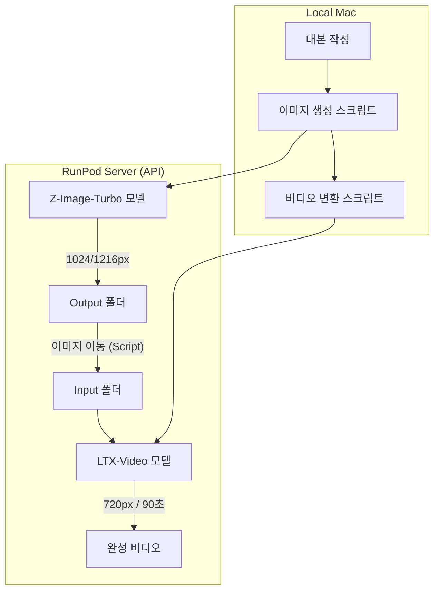

# [조선스낵] 초고속 영상 제작 파이프라인 설계도 (V1.0)

본 문서는 오늘 구축한 **"이미지(Z-Image) ➔ 비디오(LTX-Video)"** 자동 변환 시스템의 구조와 핵심 로직을 기록한 설계도입니다. 5090 환경 재세팅 시 이 가이드를 참고하여 복구하십시오.

---

## 🏗️ 시스템 아키텍처 (End-to-End Workflow)

---

## 🛠️ 핵심 구성 부품 (Stack)

### 1. 이미지 생성 (Text-to-Image)
*   **모델**: `z_image_turbo_bf16.safetensors` (최상급 원본 품질)
*   **노드 지침**: `UNETLoader` 사용 필수. (GGUF가 아님)
*   **해상도 전략**: 1024x1024 기본, 와이드 씬의 경우 1216x832 사용.
*   **샘플러**: `ModelSamplingAuraFlow` (Shift: 3.0) + `res_multistep` 스케줄러.

### 2. 비디오 변환 (Image-to-Video)
*   **모델**: `ltx-2-19b-dev-fp8.safetensors`
*   **강점**: 품질 저하 없이 VRAM 점유를 최소화하여 90초 내외로 720p 비디오 생성.
*   **워크플로우**: `LTX_TURBO_I2V_API.json` (국장님께 전송된 전용 파일).

---

## 💻 파일 및 자동화 로직 (Implementation)

### 1. `comfy_ltx_video_gen.py` (비디오 자동화의 핵심)
기존에 수동으로 하던 작업을 코드가 대신 처리합니다.
*   **자동 경로 수정**: `output` 폴더에 생성된 이미지를 API로 직접 다운로드하여 `input` 폴더로 재전송 (LoadImage 노드 에러 방지).
*   **노드 ID 클리닝**: 제이슨 파일 내의 `: (콜론)` 특수문자를 언더바로 변환하여 API 호환성 확보.
*   **프롬프트 주입**: 이미지 고정력을 높이기 위해 텍스트 프롬프트를 비우거나 `subtle cinematic motion`만 주입.

### 2. 에피소드 9 (꿩의 꾀) 프롬프트 전략
*   **비주얼 페어링**: (Character Name) + (Action Context) + (Cinematic Lighting).
*   **핵심 키워드**: `colorful Korean pheasant`, `massive scaly snake`, `misty dawn forest`.

---

## ⚠️ 트러블슈팅 및 복구 지침 (For 5090 Setup)

> [!IMPORTANT]
> **볼륨 삭제 후 재설치 시 체크포인트**
> 1. **커스텀 노드**: `ComfyUI-Manager` 설치 후 `ComfyUI_Custom_Nodes_AuraFlow` 및 `KJNodes` 설치 필수.
> 2. **부품 이름**: 서버 환경에 따라 `UNETLoader`가 없을 경우 `GGUFLoaderKJ` 등이 설치되어 있는지 확인 후 스크립트의 `class_type` 수정 필요.
> 3. **모델 경로**: `models/unet/` 또는 `models/checkpoints/`에 정확히 위치해야 함.

---

> **기획자 메모**: 오늘의 최대 성과는 런팟 웹 화면에 의존하지 않고, 터미널에서 **명령어 한 줄(Image-to-Video)**로 대량의 영상을 안정적으로 뽑아낼 수 있는 '뒷길'을 뚫은 것입니다.
